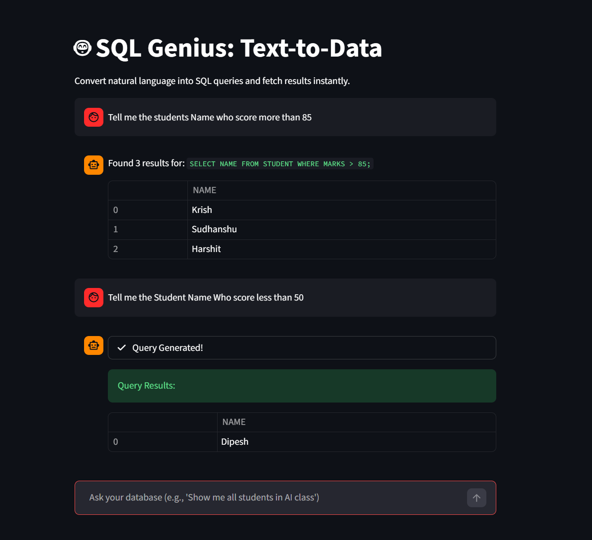

# DataSpeak-Pro 

# AI-Powered Text-to-DB Data 

**SQL Genius** is a full-stack Generative AI application that allows users to query a SQL database using natural language. No more writing complex JOINs or SELECT statements manually—simply ask your question in English, and the AI handles the rest.

---

## UI and Output Interface




## Features
* **Natural Language Processing:** Converts complex English questions into precise SQL queries.
* **Gemini 2.0 Flash Integration:** Utilizes Google's latest LLM for fast and accurate SQL generation.
* **Interactive UI:** A modern, chat-style interface built with Streamlit.
* **Real-time Execution:** Automatically executes generated queries on a SQLite database and displays results in a tabular format.
* **Persistent Chat History:** Tracks your questions and results throughout the session.

---

## Tech Stack
* **Language:** Python 3.10+
* **AI Model:** Google Gemini 2.0 Flash (via `google-genai` SDK)
* **Frontend:** Streamlit
* **Database:** SQLite3
* **Environment:** Python-dotenv

---

## Getting Started

### 1. Clone the Repository
```bash
git clone [https://github.com/your-username/SQL-Genius-AI.git](https://github.com/your-username/SQL-Genius-AI.git)
cd SQL-Genius-AI